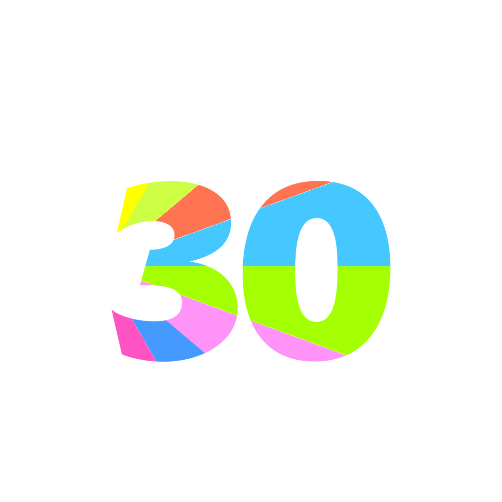
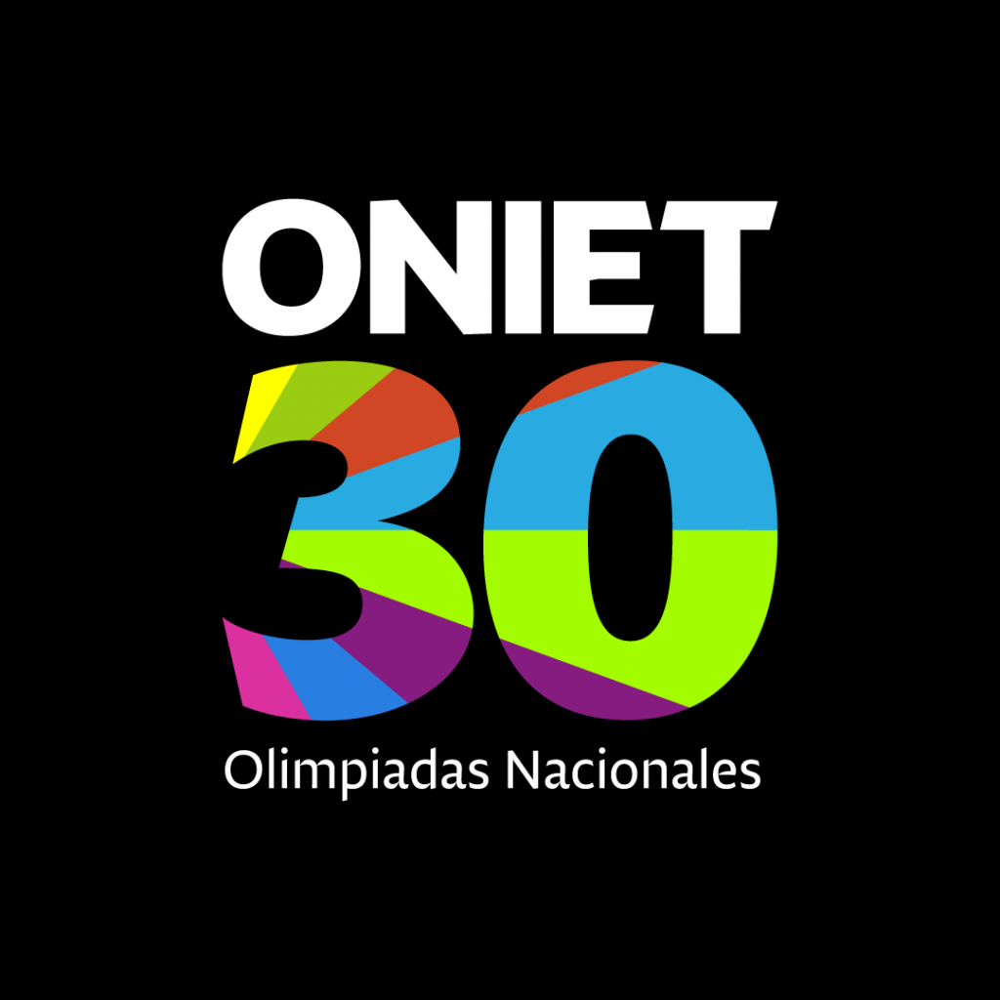

<div align="center">



# ONIET 2026 · Contador de Espectadores en Vivo

**Olimpiadas Nacionales de Innovación, Informática, Electrónica y Tecnología Aplicada**

Organizadas por la **Universidad Blas Pascal** · Córdoba, Argentina

[](LICENSE)
[](requirements.txt)
[](requirements.txt)
[](requirements.txt)
[](https://oniet.ubp.edu.ar/)
[](https://oniet.ubp.edu.ar/que-son/)

</div>

<br>

## Índice

- [Sobre ONIET](#sobre-oniet)
- [Categorías y disciplinas](#categorías-y-disciplinas)
- [Sobre esta aplicación](#sobre-esta-aplicación)
- [Stack tecnológico](#stack-tecnológico)
- [Instalación y uso](#instalación-y-uso)
- [Estructura del proyecto](#estructura-del-proyecto)
- [Contacto y enlaces oficiales](#contacto-y-enlaces-oficiales)
- [Licencia](#licencia)

<br>

## Sobre ONIET

Las **ONIET** (Olimpiadas Nacionales de Innovación, Informática, Electrónica y Tecnología Aplicada) son una de las competencias académicas más relevantes de Argentina para estudiantes de nivel secundario. La **Universidad Blas Pascal** es organizadora y anfitriona del evento desde **1996**, acumulando casi tres décadas de funcionamiento continuo.

> *"Las ONIET buscan desarrollar y potenciar la vocación profesional de los jóvenes a través de proyectos multidisciplinares"*, con el acompañamiento de docentes, profesionales y tutores — permitiendo que los estudiantes demuestren sus capacidades intelectuales y técnicas.

**Alcance del evento:**

- 🎓 Participan estudiantes secundarios de todo el país, de colegios de múltiples provincias.
- 🗓️ El evento se desarrolla a lo largo de cinco días, combinando modalidades virtuales y presenciales.
- 🤝 Cuenta con el apoyo de adherentes institucionales y empresariales, como Accenture y organismos provinciales.

<br>

## Categorías y disciplinas

ONIET reúne **34 competencias** distribuidas en **8 categorías**:

| Categoría | Competencias |
|---|---|
| **Tecnología** | Tecnopedia, Desarrollo de Sistemas, Resolución de Problemas, One-day Videogame, ElectroSaber I & II, ElectroProblema I & II, Electrónica Discreta, Microcontroladores, Full Game |
| **Cultura** | Desafío Cultural, Relatos con IA, Buscando el saber, Tópicos de Actualidad, Ajedrez Online, Ajedrez Presencial, Maravillas locales, Personal Pitch |
| **Ciencias Básicas** | MachinePlus, Batalla Matemática, Speed Cube |
| **Gestión y Negocios** | Cuentas Claras, Proyecto Escuela, FirstPlan |
| **Diseño y Comunicación** | Diseño de Postales, Mirando hacia el Futuro |
| **Urbanismo y Sociedad** | Tu Colegio Ideal, Quién da más, Poder Ciudadano |
| **Innovación** | Prototipos, Robots y Cartón |
| **Sostenibilidad, Gestión Ambiental y Turismo** | Circu-Lab: Ideas que transforman, Reinventar el Turismo |

<br>

## Sobre esta aplicación

Este repositorio contiene la pantalla de **transmisión en vivo** utilizada para el aniversario de ONIET: una vista a pantalla completa con video de fondo institucional, el isologotipo de la edición y un **contador de espectadores en tiempo real**, sincronizado entre todas las pantallas conectadas mediante WebSockets.

<div align="center">

</div>

<br>

## Stack tecnológico

| Componente | Tecnología |
|---|---|
| Backend | [Flask](https://flask.palletsprojects.com/) |
| Tiempo real | [Flask-SocketIO](https://flask-socketio.readthedocs.io/) / [Socket.IO](https://socket.io/) |
| Servidor asíncrono | [Eventlet](https://eventlet.readthedocs.io/) |
| Frontend | HTML5 + CSS3 (video de fondo, animaciones con degradé institucional) |
| Assets grandes | [Git LFS](https://git-lfs.github.com/) (video de fondo) |

<br>

## Instalación y uso

```bash
# 1. Clonar el repositorio (requiere Git LFS instalado)
git lfs install
git clone https://github.com/JFIEROLI/ONIET-2026.git
cd ONIET-2026

# 2. Instalar dependencias
pip install -r requirements.txt

# 3. Levantar el servidor
python app.py
```

La aplicación queda disponible en `http://localhost:5000`. Para actualizar el contador desde otro proceso (lector, panel de administración, etc.), invocar `set_count(n)` o `increment(delta)` desde `app.py`.

<br>

## Estructura del proyecto

```
ONIET-2026/
├── app.py                    # Servidor Flask + Socket.IO
├── requirements.txt
├── templates/
│   └── index.html            # Pantalla de transmisión en vivo
├── static/img/
│   └── logo-oniet30.png      # Isologotipo edición 30 años
└── img/
    └── video-fondo.mp4       # Video de fondo (Git LFS)
```

<br>

## Contacto y enlaces oficiales

- 🌐 Sitio oficial: [oniet.ubp.edu.ar](https://oniet.ubp.edu.ar/)
- ℹ️ Qué son las ONIET: [oniet.ubp.edu.ar/que-son](https://oniet.ubp.edu.ar/que-son/)
- 🏆 Competencias: [oniet.ubp.edu.ar/competencias](https://oniet.ubp.edu.ar/competencias/)
- 📝 Inscripción: [ecommerce.ubp.edu.ar/oniet](https://ecommerce.ubp.edu.ar/oniet)
- 💻 Plataforma de participantes: [miubp-oniet.ubp.edu.ar](https://miubp-oniet.ubp.edu.ar/)
- ✉️ Email: oniet@ubp.edu.ar
- 📞 Teléfono: (+54) 351 414 4444

<br>

## Licencia

Distribuido bajo licencia [MIT](LICENSE).

<div align="center">
<sub>© Universidad Blas Pascal — ONIET, Olimpiadas Nacionales. Todos los derechos reservados sobre la marca y el contenido institucional.</sub>
</div>
